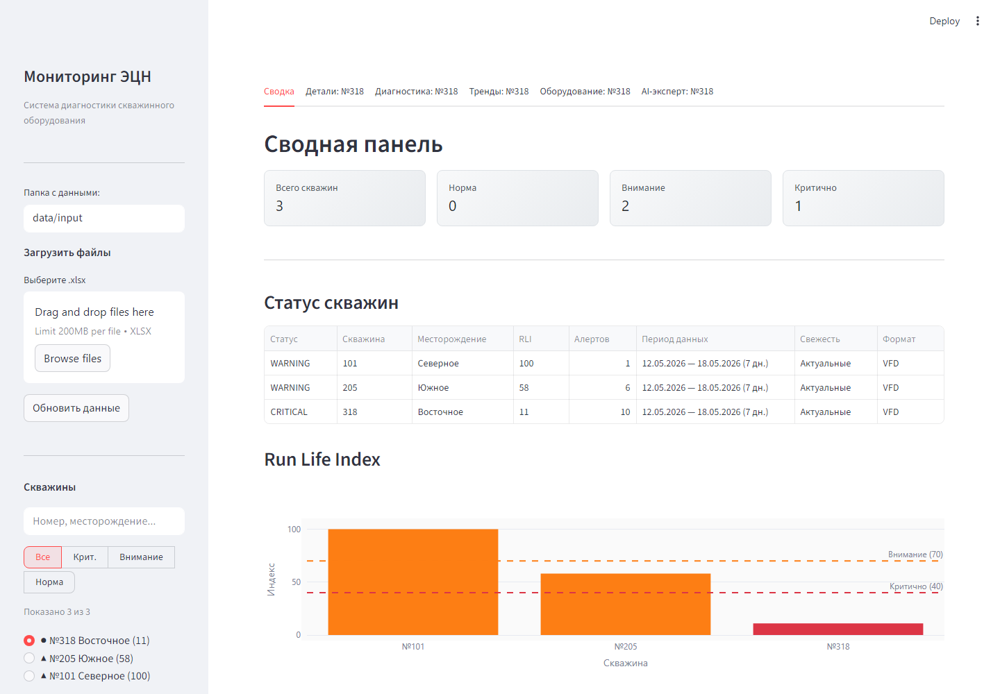
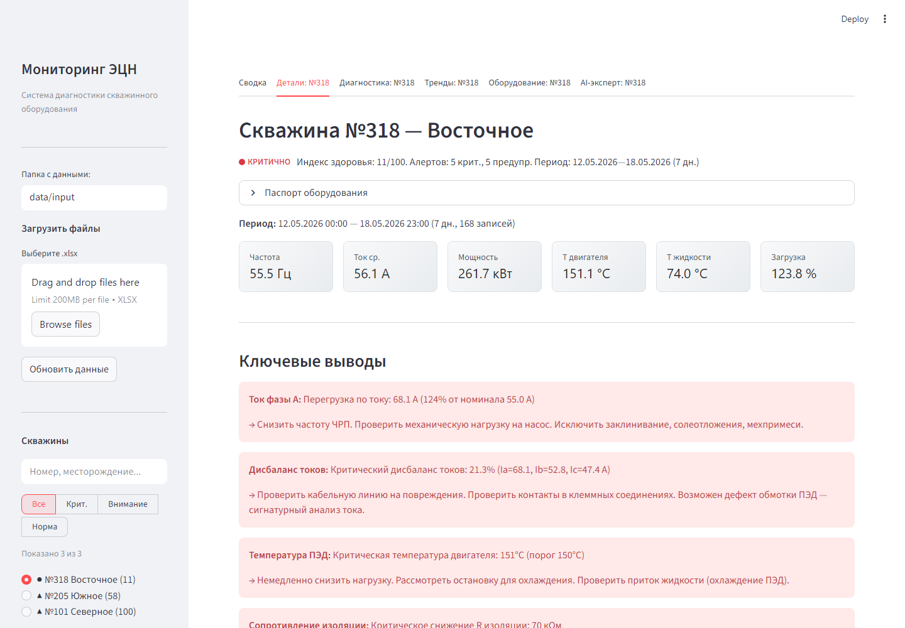
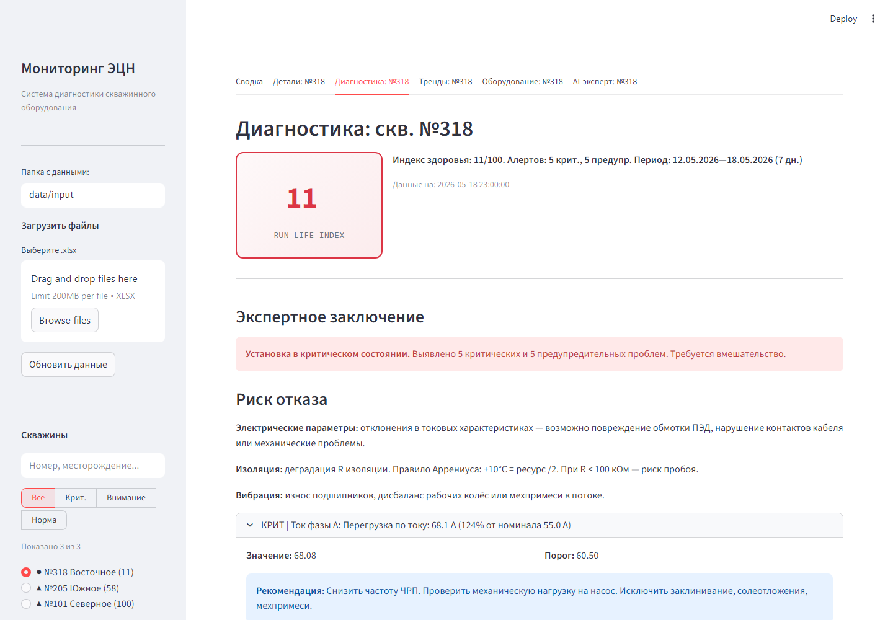
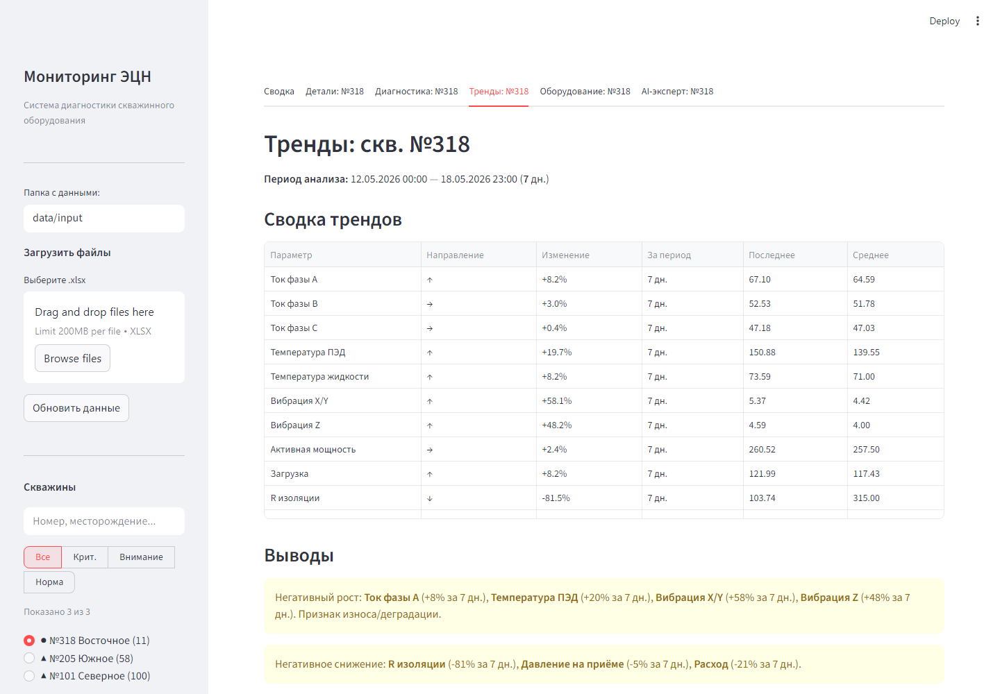

# Проекты и кейсы

Этот раздел дополняет резюме и GitHub-профиль. Часть проектов реализована в корпоративной среде, поэтому здесь описаны задачи, роль, подход и результат без раскрытия конфиденциальных данных. Публичный код доступен там, где указана ссылка на GitHub.

## 1. Мониторинг ЭЦН — публичный технический проект

**Ссылка:** [Ivan0208/ecn-monitoring](https://github.com/Ivan0208/ecn-monitoring)

**Контекст:** нефтегазовая эксплуатация требует регулярного анализа данных по электроцентробежным насосам. Ручная работа с XLSX-файлами станций управления занимает время и повышает риск пропуска ранних признаков отказа.

**Цель:** создать MVP-систему, которая автоматически обрабатывает данные, рассчитывает диагностические признаки и показывает технологу состояние установки в понятном веб-интерфейсе.

**Что реализовано:**

- автоматическое определение формата XLSX-файлов ЧРП/ПЧ и КСУ Новомет;
- парсинг Excel-данных и подготовка нормализованной структуры;
- расчет диагностических правил по токам, температуре, изоляции, вибрации, частоте и трендам;
- комплексный индекс состояния установки Run Life Index;
- Streamlit-дашборд с метриками, статусами и интерактивными Plotly-графиками;
- рекомендации технологу по выявленным отклонениям;
- AI-эксперт для формирования отчета по выбранной скважине.

**Роль:** автор идеи, постановщик требований, аналитик предметной области, разработчик MVP.

**Стек:** Python, pandas, NumPy, SciPy, openpyxl, SQLite, YAML, Plotly, Streamlit, requests.

**Чем полезен работодателю:** проект показывает способность превращать отраслевую экспертизу в работающий цифровой инструмент: от понимания оборудования до веб-интерфейса, аналитики и AI-модуля.

### Скриншоты интерфейса

Скриншоты сделаны на демонстрационных данных, чтобы показать пользовательский сценарий и визуальную структуру продукта без раскрытия реальных производственных данных.

| Сводная панель фонда | Карточка скважины |
|---|---|
|  |  |

| Диагностика | Тренды |
|---|---|
|  |  |

## 2. Редизайн ролевой модели системы импортных поставок

- **Компания:** ООО «ИТ ИКС 5 ТЕХНОЛОГИИ»
- **Роль:** старший бизнес-аналитик
- **Домен:** продуктовая IT-разработка, импортные поставки, ролевая модель, требования.

**Проблема:** в системе управления импортными поставками накопилось большое количество ролей с дублированием, избыточностью и усложненным администрированием.

**Что делал:**

- проводил коммуникацию с бизнес-заказчиками и уточнял целевую модель доступа;
- анализировал текущую структуру ролей и функциональные пересечения;
- формализовал бизнес-требования, функциональные и нефункциональные требования;
- описывал критерии приемки, User Stories и задачи для разработки;
- взаимодействовал с архитекторами, сервис-менеджерами и подрядчиками;
- курировал внедрение изменений.

**Результат:** 148 ролей оптимизированы до 18 при сохранении полной функциональности.

**Ключевые навыки:** бизнес-анализ, системный анализ, stakeholder management, BPMN, User Stories, acceptance criteria, Jira/Confluence, продуктовый подход.

## 3. Система оптимизационных проектов и производственной эффективности

- **Компания:** АО «ФОРТЕИНВЕСТ»
- **Роль:** начальник отдела оптимизации производственных затрат
- **Домен:** нефтегаз, производственная эффективность, внутренний аудит, оптимизация затрат.

**Проблема:** компании требовался управляемый процесс выявления, оценки, согласования и мониторинга оптимизационных инициатив.

**Что делал:**

- выстроил с нуля бизнес-процессы подачи, разработки, утверждения и мониторинга оптимизационных проектов;
- разработал пакет регламентирующей документации;
- проверял гипотезы по эффективности производства на основе данных;
- разрабатывал матрицы рисков и процедуры контроля;
- руководил тремя подразделениями направления оптимизации затрат;
- согласовывал инициативы с профильными подразделениями.

**Результаты:**

- реализовано 3 проекта оптимизации бизнес-процессов;
- оценено и согласовано более 48 мероприятий по оптимизации;
- подготовлены аналитические презентации и материалы для принятия управленческих решений.

**Ключевые навыки:** process optimization, risk matrix, KPI, аналитика затрат, регламенты, управление подразделениями, stakeholder management.

## 4. Энергоменеджмент ISO 50001 и снижение энергозатрат

- **Компании:** АО «ФОРТЕИНВЕСТ», ОАО «БЕЛКАМНЕФТЬ»
- **Домен:** нефтедобыча, энергоменеджмент, ISO 50001, производственные KPI.

**Цель:** снизить энергозатраты добывающих активов и сделать энергопотребление управляемым через показатели, нормы и контроль мероприятий.

**Что делал:**

- анализировал энергопотребление дочерних и добывающих активов;
- разрабатывал удельные нормы и KPI по направлениям;
- выявлял потенциал снижения энергозатрат;
- рассчитывал экономическую эффективность мероприятий;
- участвовал во внедрении системы энергоменеджмента ISO 50001.

**Результаты:**

- снижение затрат на электроэнергию добывающего актива на 4%;
- снижение затрат на электроэнергию добывающего актива на 5% в отдельном проекте;
- оценено более 350 оптимизационных мероприятий;
- лично разработано и рассчитано 15 мероприятий по повышению эффективности.

**Ключевые навыки:** energy management, ISO 50001, data analysis, KPI, нефтегазовая эксплуатация, экономическая оценка.

## 5. Аналитика надежности насосного оборудования

- **Компания:** ОАО «БЕЛКАМНЕФТЬ»
- **Роль:** инженер-технолог / ведущий инженер-технолог по добыче нефти и газа
- **Домен:** добыча нефти, насосное оборудование, технологические режимы, отказность.

**Проблема:** необходимо было снизить отказы подземного насосного оборудования и выявлять причины отклонений на основе технологических данных.

**Что делал:**

- анализировал режимы работы скважин и графические представления работы оборудования;
- выявлял паттерны, тренды и потенциальные проблемы;
- подбирал глубинно-насосное оборудование под разные режимы;
- разрабатывал геолого-технические мероприятия для выполнения плановых показателей добычи;
- анализировал исторические данные по шурфовым установкам за 2 года.

**Результаты:**

- снижение отказов подземного насосного оборудования на 8%;
- выявлена причина преждевременных отказов на 8 шурфовых установках;
- межремонтный период увеличен на 30%.

**Ключевые навыки:** промышленная аналитика, диагностика оборудования, root cause analysis, технологические режимы, добыча нефти.

## 6. Визуализация и контроль дебита скважин

- **Компания:** АО «ФОРТЕИНВЕСТ»
- **Домен:** нефтедобыча, мониторинг скважин, визуализация данных.

**Задача:** ускорить обнаружение отказов оборудования и сделать контроль дебита более наглядным без дополнительных затрат на внешние системы.

**Что делал:**

- анализировал доступные производственные данные;
- проектировал логику контроля и визуального представления;
- разрабатывал инструмент визуализации и мониторинга;
- адаптировал вывод под задачи специалистов, принимающих решения.

**Результат:** инструмент визуализации и контроля дебита скважин сократил время обнаружения отказов оборудования.

**Ключевые навыки:** data visualization, industrial analytics, dashboard thinking, нефтегазовая предметная область.

## 7. AI-инструменты для бизнес-аналитиков

- **Компания:** ООО «ИТ ИКС 5 ТЕХНОЛОГИИ»
- **Контекст:** участие в Гильдии аналитиков X5 и внедрение AI-инструментов в работу аналитиков.

**Что делаю:**

- применяю LLM и AI-инструменты для ускорения аналитической работы;
- использую VS Code и Roo Code для AI-assisted coding и вайбкодинга;
- проектирую AI-агентов и сценарии в Langflow;
- веду собственный воркшоп по Langflow;
- выступал на митапе по интеграции искусственного интеллекта в работу бизнес-аналитиков.

**Практическая ценность:**

- ускорение подготовки аналитических материалов;
- генерация черновиков требований, сценариев, тест-кейсов и документации;
- прототипирование AI-помощников для аналитиков;
- повышение качества и повторяемости аналитической работы.

**Ключевые навыки:** LLM, Prompt Engineering, Langflow, AI agents, Roo Code, VS Code, AI-assisted coding, knowledge workflows.

## 8. Анализ складских остатков и МТР

- **Компания:** АО «ФОРТЕИНВЕСТ»
- **Домен:** производственные запасы, МТР, экономическая эффективность.

**Задача:** выявить неликвидные запасы и материалы без движения на двух предприятиях.

**Что делал:**

- собирал и анализировал данные по складским остаткам;
- выделял неликвиды и позиции без движения;
- готовил выводы для профильных подразделений;
- оценивал потенциальный экономический эффект.

**Результат:** выявлены неликвидные запасы и МТР без движения, что обеспечило значительный экономический эффект.

**Ключевые навыки:** data analysis, inventory analytics, экономическая оценка, управленческая отчетность.

## Публичные проекты, которые стоит добавить дальше

Чтобы усилить GitHub именно под трудоустройство, полезно постепенно добавить 3-4 демонстрационных проекта с кодом и понятными README:

1. **AI Business Analyst Assistant** — веб-инструмент, который по описанию задачи генерирует черновик BRD, User Stories, acceptance criteria и список вопросов к заказчику.
2. **Process Mining Demo** — анализ event log, выявление узких мест процесса, визуализация отклонений и рекомендации по улучшению.
3. **Energy Efficiency Dashboard** — расчет KPI энергопотребления, нормирование, отклонения, экономический эффект и сценарии оптимизации.
4. **Requirements Quality Checker** — LLM-инструмент для проверки требований на полноту, неоднозначность, тестируемость и соответствие INVEST/SMART.

Эти проекты логично продолжат текущий профиль: бизнес-анализ + данные + веб-интерфейсы + AI + производственная экспертиза.
